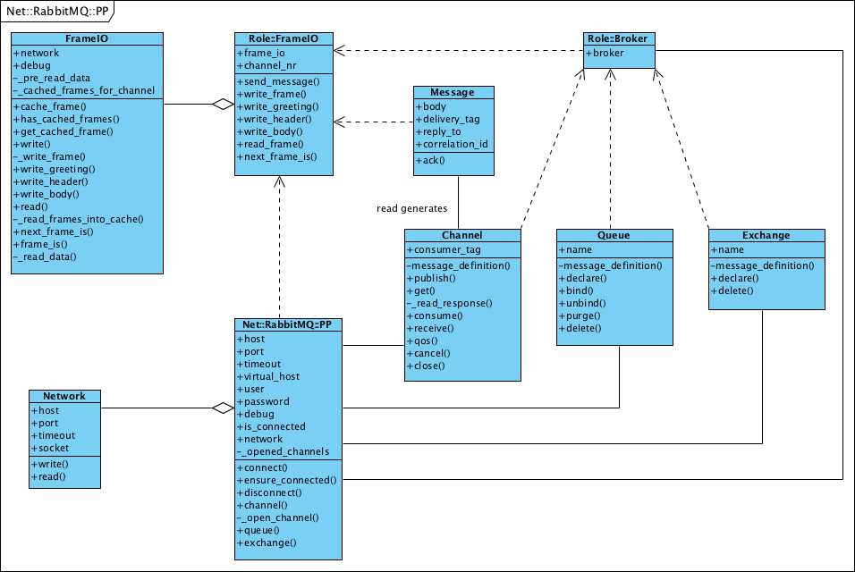

Simple MessageQ based on Net::RabbitMQ
======================================

Sender:

    use MessageQ;
    
    my $m = MessageQ->new(
        host     => 'localhost',
        user     => 'worker',
        password => 'worker',
    );
    
    $m->publish(queue_name => { message => 'structure', with => 'info' });

Reveiver:

    use MessageQ;
    
    my $m = MessageQ->new(
        host     => 'localhost',
        user     => 'worker',
        password => 'worker',
    );
    
    $m->consume('queue_name');
    
    while (my $message = $m->recv) {
        # so something with $message->data
    }

Implementation:

