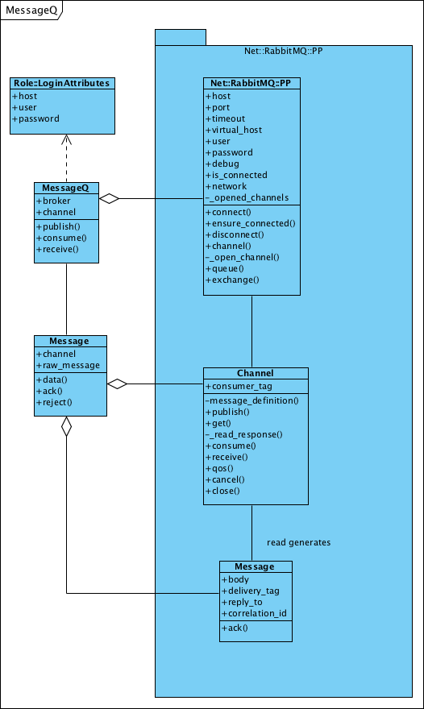

Simple MessageQ based on Net::RabbitMQ
======================================

Producer:

    use MessageQ;
    
    my $m = MessageQ->new(
        host     => 'localhost',
        user     => 'worker',
        password => 'worker',
    );
    
    $m->publish(exchange_name => { some => 'structure', with => 'info' });

Consumer:

    use MessageQ;
    
    my $m = MessageQ->new(
        host     => 'localhost',
        user     => 'worker',
        password => 'worker',
    );
    
    $m->consume('queue_name', no_ack => 0);
    
    while (my $message = $m->receive) {
        # so something with $message->data
        
        # no_ack => 0 means: a message needs an ack()
        $message->ack;
    }

Implementation:

